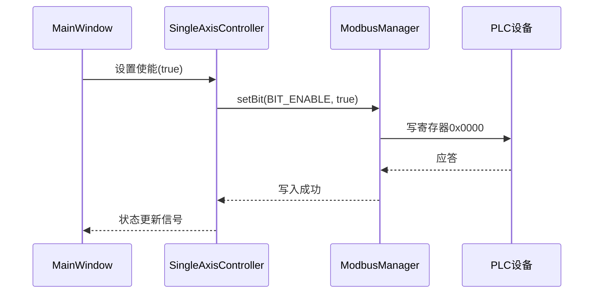

# 磁悬浮控制系统代码说明文档

## 概述

本文档为磁悬浮控制系统提供详细的代码结构说明，帮助新加入团队的开发人员快速理解项目架构和核心功能实现。

## 1. 项目整体架构

### 1.1 技术栈
- **开发框架**: Qt 5.12+ (C++17)
- **通信协议**: Modbus TCP over Ethernet  
- **构建系统**: qmake
- **目标平台**: Windows 7/8/10/11 (64位)

### 1.2 核心依赖
```cpp
QT += core gui serialbus widgets network
```

### 1.3 项目文件结构
```
MaglevControl/
├── main.cpp                    // 程序入口
├── mainwindow.h/.cpp           // 主窗口（GUI控制器）
├── modbusmanager.h/.cpp        // Modbus通信管理器
├── basecontroller.h/.cpp       // 控制器基类
├── singleaxiscontroller.h/.cpp // 单轴控制器
├── multiaxiscontroller.h/.cpp  // 多轴控制器  
├── recipemanager.h/.cpp        // 配方管理器
├── recipewidget.h/.cpp         // 配方界面组件
├── logmanager.h/.cpp           // 日志管理器
├── stylemanager.h/.cpp         // UI样式管理器
├── Resource/                   // 资源文件
│   ├── Icon.qrc               // 图标资源
│   ├── mcs.png                // 应用图标
│   └── style.qss              // 样式表
└── README/                     // 文档目录
    ├── PLC对接技术说明.md      // PLC对接技术文档
    └── 代码说明文档.md         // 本文档
```

## 2. 模块化架构设计

### 2.1 架构图
```
MainWindow (GUI控制器)
├── ModbusManager (通信层)
├── SingleAxisController (单轴控制)
├── MultiAxisController (多轴控制)  
├── RecipeManager (配方管理)
├── RecipeWidget (配方界面)
├── LogManager (日志系统)
└── StyleManager (UI主题)
```

### 2.2 模块职责划分

| 模块 | 职责 | 核心功能 |
|------|------|----------|
| MainWindow | GUI控制器 | UI布局、事件分发、模块协调 |
| ModbusManager | 通信管理 | TCP连接、寄存器读写、心跳维护 |
| BaseController | 控制基类 | 通用功能、错误处理、连接检查 |
| SingleAxisController | 单轴控制 | 单电机控制、手动/自动模式 |
| MultiAxisController | 多轴控制 | 多电机批量管理、同步操作 |
| RecipeManager | 配方管理 | 工位配方、参数持久化 |
| RecipeWidget | 配方界面 | 配方编辑、参数输入、批量操作 |
| LogManager | 日志系统 | 操作记录、错误追踪、文件输出 |
| StyleManager | 样式管理 | 工业化主题、UI统一样式 |

## 3. 核心模块详解

### 3.1 ModbusManager - 通信管理器

**文件**: `modbusmanager.h/.cpp`

#### 核心功能
- Modbus TCP连接管理
- 寄存器读写操作  
- 10秒心跳维护(避免自动断连)
- 掩码写操作(功能码0x16，原子按位写)

#### 关键方法
```cpp
// 连接管理
bool connectToDevice(const QString& ip, int port);
void disconnectDevice();
QModbusDevice::State connectionState() const;

// 寄存器操作
bool writeRegister(int address, quint16 value);               // 异步写
bool writeRegisterSync(int address, quint16 value, int timeoutMs = 5000);  // 同步写
bool readRegisterSync(int address, quint16& value, int timeoutMs = 5000);   // 同步读

// 心跳和掩码写
void startHeartbeat(int intervalMs = kHeartbeatIntervalMs);   // 启动10秒心跳
bool maskWriteRegisterSync(int address, quint16 andMask, quint16 orMask, int timeoutMs = 5000);
```

#### 关键常量
```cpp
static constexpr int kHeartbeatIntervalMs = 10000;  // 10秒心跳间隔
```

#### 默认连接参数
- **IP地址**: 192.168.5.5
- **端口**: 502 (Modbus TCP标准端口)
- **心跳间隔**: 10秒

### 3.2 BaseController - 控制器基类

**文件**: `basecontroller.h/.cpp`

#### 设计目的
为所有控制器提供通用功能，避免代码重复。

#### 核心功能
```cpp
class BaseController : public QObject
{
protected:
    bool checkConnection();                              // 检查连接状态
    void emitError(const QString& baseMessage, const QString& detail = "");
    void emitError(const QString& baseMessage, int value);

signals:
    void errorOccurred(const QString& error);            // 错误信号
    void statusChanged(const QString& message);          // 状态变化信号

protected:
    ModbusManager* m_modbusManager;                      // Modbus管理器引用
};
```

### 3.3 SingleAxisController - 单轴控制器

**文件**: `singleaxiscontroller.h/.cpp`

#### 功能概述
精确控制单个电机的运行，支持手动点动和自动运行两种模式。

#### 参数结构体
```cpp
struct SingleAxisParams {
    bool enable;             // 使能状态（0=禁用，1=使能）
    bool allowManual;        // 允许手动控制（0=禁止，1=允许）  
    bool runMode;            // 运行模式（0=点动，1=自动）

    qint32 autoSpeed;        // 自动模式速度（rpm每分钟转速）
    bool clickOKBtn;         // 自动模式下点击OK开始运动

    qint32 jogSpeed;         // 手动模式Jog速度（rpm）
    qint32 jogPosition;      // 手动模式Jog位置（mm，支持正负）
    short jog;               // 点动按钮（0=初始，1=左，2=右）
};
```

#### 寄存器地址映射
```cpp
static const int CONTROL_REG = 0x0000;         // 控制寄存器
static const int AUTO_SPEED_LOW_REG = 0x0001;  // 自动速度低16位
static const int AUTO_SPEED_HIGH_REG = 0x0002; // 自动速度高16位  
static const int JOG_POSITION_REG = 0x0003;    // Jog位置
static const int JOG_SPEED_LOW_REG = 0x0004;   // Jog速度低16位
static const int JOG_SPEED_HIGH_REG = 0x0005;  // Jog速度高16位
```

#### 控制寄存器位定义
```cpp
static const int BIT_ENABLE = 0;           // bit0: 使能
static const int BIT_MODE = 1;             // bit1: 运行模式
static const int BIT_MANUAL_ALLOW = 2;     // bit2: 允许手动控制
static const int BIT_JOG_LEFT = 3;         // bit3: Jog左
static const int BIT_JOG_RIGHT = 4;        // bit4: Jog右  
static const int BIT_AUTO_RUN = 5;         // bit5: 自动运行
```

#### 32位数据处理
```cpp
void writeSpeedToRegisters(int speed, int lowReg, int highReg)
{
    // 拆分32位速度值为高低16位
    quint16 high16 = static_cast<quint16>((speed >> 16) & 0xFFFF);
    quint16 low16 = static_cast<quint16>(speed & 0xFFFF);
    
    m_modbusManager->writeRegister(lowReg, low16);   // 先写低16位
    m_modbusManager->writeRegister(highReg, high16); // 后写高16位
}
```

### 3.4 MultiAxisController - 多轴控制器

**文件**: `multiaxiscontroller.h/.cpp`

#### 功能概述
管理多个电机的批量操作，支持动态添加/删除轴，统一参数设置。

#### 数据结构
```cpp
struct MultiAxisParams {
    bool enable;           // 使能状态
    qint32 autoSpeed;      // 自动模式速度（rpm）
};

struct AxisInfo {
    int axisId;            // 轴编号
    MultiAxisParams params; // 轴参数
};
```

#### 寄存器分配
```cpp
static const int ENABLE_BASE_REG = 0x0100;   // 使能寄存器基址
static const int SPEED_BASE_REG = 0x0200;    // 速度寄存器基址
```

#### 核心方法
```cpp
// 轴管理
int addAxis();                    // 添加新轴，返回轴ID
bool removeAxis(int axisId);      // 移除指定轴
int getAxisCount() const;         // 获取轴数量

// 单轴控制  
bool setAxisEnable(int axisId, bool enable);
bool setAxisSpeed(int axisId, int speed);

// 批量控制
bool enableAllAxes();             // 使能所有轴
bool disableAllAxes();            // 禁用所有轴
bool setAllAxesSpeed(int speed);  // 设置所有轴速度
```

### 3.5 RecipeManager - 配方管理器

**文件**: `recipemanager.h/.cpp`

#### 功能概述
管理工位配方参数，支持完整配方的保存/加载/应用。

#### 配方数据结构
```cpp
struct StationRecipe {
    // 基本参数（每个工位占8个寄存器）
    quint8 stationNo;           // 工位NO
    quint8 taskId;              // 任务ID（工艺类型）
    quint8 segmentNo;           // 所属路段号
    quint8 nextStationId;       // 目标工位号
    
    // 16位参数
    quint16 segmentPosition;    // 路段位置
    quint16 segmentSpeed;       // 路段速度
    quint16 startPosition;      // 起始位置
    quint16 endPosition;        // 终止位置
    quint16 arrivalDelay;       // 到位延时
    
    // 枚举参数
    FerryPosition ferryPos;     // 摆渡位置
    bool stationMask;           // 工位屏蔽
    
    quint16 recipeId;           // 配方ID
};
```

#### 工艺类型枚举
```cpp
enum class ProcessType : quint16 {
    Winding = 1,    // 绕线
    Gluing = 2,     // 点胶
    Welding = 3,    // 焊接  
    Molding = 4,    // 注塑
    Unloading = 5   // 下料
};

enum class FerryPosition : quint16 {
    None = 0,       // 无摆渡
    Pos1 = 1,       // 位置1
    Pos2 = 2        // 位置2
};
```

#### Modbus寄存器映射
```cpp
static const int STATION_COUNT_ADDR = 0x0023;  // 寄存器[35]：工位总数
static const int BASE_ADDR = 0x0024;           // 寄存器[36]：配方数据基址  
static const int STATION_SIZE = 8;             // 每个工位占用8个寄存器
```

#### 8寄存器布局
| 偏移 | 寄存器 | 数据内容 | 格式 |
|------|--------|----------|------|
| 0 | BASE_ADDR+0 | 工位号+任务ID | 8位+8位打包 |
| 1 | BASE_ADDR+1 | 路段号+目标工位号 | 8位+8位打包 |
| 2 | BASE_ADDR+2 | 路段位置 | 16位整数 |
| 3 | BASE_ADDR+3 | 路段速度 | 16位整数 |
| 4 | BASE_ADDR+4 | 起始位置 | 16位整数 |
| 5 | BASE_ADDR+5 | 终止位置 | 16位整数 |
| 6 | BASE_ADDR+6 | 到位延时 | 16位整数 |
| 7 | BASE_ADDR+7 | 摆渡位置+工位屏蔽 | 8位+8位打包 |

#### 8位数据打包/解包
```cpp
// 打包：两个8位值合并为一个16位寄存器
quint16 packTwoBytes(quint8 lowByte, quint8 highByte) const
{
    return (static_cast<quint16>(highByte) << 8) | static_cast<quint16>(lowByte);
}

// 解包：从16位寄存器提取两个8位值
void unpackTwoBytes(quint16 value, quint8& lowByte, quint8& highByte) const
{
    lowByte = static_cast<quint8>(value & 0xFF);        // 低8位
    highByte = static_cast<quint8>((value >> 8) & 0xFF); // 高8位
}
```

### 3.6 MainWindow - 主窗口控制器

**文件**: `mainwindow.h/.cpp`

#### 功能概述
应用程序的GUI控制器，负责界面布局、用户交互、模块协调。

#### UI架构
- **布局方式**: 选项卡式界面(QTabWidget)
- **主要区域**: 
  - 连接设置区域
  - 单轴控制选项卡
  - 多轴控制选项卡
  - 配方管理选项卡
  - 实时日志区域

#### 模块初始化流程
```cpp
void initModules()
{
    // 按依赖关系依次初始化
    m_modbusManager = new ModbusManager(this);
    m_singleAxisController = new SingleAxisController(m_modbusManager, this);
    m_multiAxisController = new MultiAxisController(m_modbusManager, this);
    m_recipeManager = new RecipeManager(m_modbusManager, this);
    m_recipeWidget = new RecipeWidget(m_recipeManager, this);
    m_logManager = new LogManager(this);
}

void connectSignals()
{
    // 建立模块间信号槽连接
    connect(m_modbusManager, &ModbusManager::stateChanged, 
            this, &MainWindow::onModbusStateChanged);
    connect(m_singleAxisController, &SingleAxisController::statusChanged,
            this, &MainWindow::onSingleAxisStatusChanged);
    // ... 其他信号连接
}
```

## 4. 数据流和通信协议

### 4.1 Modbus TCP通信流程



### 4.2 32位数据处理流程

```cpp
// 示例：设置自动速度80000 rpm
int speed = 80000;  // 0x13880

// 1. 数据拆分
quint16 low16 = speed & 0xFFFF;        // 0x3880
quint16 high16 = (speed >> 16) & 0xFFFF;  // 0x0001

// 2. 分别写入寄存器
writeRegister(0x0001, low16);   // 低16位 -> 寄存器0x0001
writeRegister(0x0002, high16);  // 高16位 -> 寄存器0x0002

// 3. PLC读取时重组
// PLC端: full_speed = (reg[0x0002] << 16) | reg[0x0001]
```

### 4.3 心跳机制

为避免长时间无通信导致的自动断连，系统实现10秒心跳机制：

```cpp
void onHeartbeatTimeout()
{
    if (m_modbusClient->state() == QModbusDevice::ConnectedState) {
        // 尝试掩码写（功能码0x16），失败时fallback到读写
        const quint16 andMask = 0xFFFF; 
        const quint16 orMask = 0x8000;
        bool ok = maskWriteRegisterSync(0x0000, andMask, orMask, 2000);
        
        if (!ok) {
            // fallback: 读取寄存器0，设置bit15并写回
            quint16 v = 0;
            if (readRegisterSync(0x0000, v)) {
                const quint16 nv = static_cast<quint16>(v | 0x8000);
                if (nv != v) {
                    writeRegisterSync(0x0000, nv);
                }
            }
        }
    }
}
```

## 5. 错误处理和日志系统

### 5.1 分层错误处理

1. **ModbusManager层**: 处理网络连接、协议错误
2. **Controller层**: 处理业务逻辑错误  
3. **UI层**: 展示错误信息，用户交互

### 5.2 错误信息格式化

```cpp
// BaseController提供的统一错误处理
void emitError(const QString& baseMessage, const QString& detail = "")
{
    QString fullMessage = detail.isEmpty() ? baseMessage : 
                         QString("%1: %2").arg(baseMessage, detail);
    emit errorOccurred(fullMessage);
}
```

### 5.3 日志系统

**LogManager**提供分级日志记录：
- 操作日志：正常操作记录
- 错误日志：错误和异常记录  
- 调试日志：开发调试信息

## 6. UI设计和样式

### 6.1 工业化主题

通过`StyleManager`和`style.qss`实现统一的工业化深色主题：
- 深灰色背景
- 高对比度文字
- 清晰的状态指示
- 一致的控件样式

### 6.2 响应式布局

界面支持不同窗口尺寸的适配：
- 默认窗口尺寸：1500x700像素
- 组件自适应缩放
- 选项卡式布局便于功能模块切换

## 7. 开发和调试指南

### 7.1 构建环境

```bash
# Windows + Qt Creator (推荐)
# 打开 MaglevControl.pro 并构建

# 命令行构建 (MSVC)
qmake MaglevControl.pro
nmake

# 命令行构建 (MinGW)  
qmake MaglevControl.pro
mingw32-make

# 发布版本
qmake MaglevControl.pro -config release
nmake
```

### 7.2 调试技巧

1. **网络连接调试**
   - 使用ping测试网络连通性
   - 检查PLC的Modbus TCP端口状态
   - 监控ModbusManager的连接状态变化

2. **寄存器操作调试**  
   - 启用Qt调试输出查看寄存器读写日志
   - 使用第三方Modbus工具验证寄存器值
   - 检查32位数据的高低字组合

3. **UI响应调试**
   - 检查信号槽连接是否正确
   - 监控状态变化信号的传播
   - 验证参数更新的即时性

### 7.3 常见问题解决

1. **连接超时**: 检查IP地址、端口配置，确认PLC网络状态
2. **数据异常**: 验证寄存器地址映射，检查数据格式转换
3. **界面卡顿**: 检查是否有阻塞操作，使用异步通信
4. **配方数据错误**: 验证8寄存器布局，检查打包/解包算法

## 8. 扩展开发建议

### 8.1 添加新功能模块

1. 继承`BaseController`创建新的控制器类
2. 在`MainWindow::initModules()`中初始化
3. 在`MainWindow::connectSignals()`中建立信号连接
4. 添加对应的UI组件和布局
5. 更新.pro文件包含新的源码文件

### 8.2 协议扩展

1. 在对应Controller中定义新的寄存器地址常量
2. 实现新的参数结构体和转换方法
3. 扩展Modbus通信接口（如需要新的功能码）
4. 更新PLC对接文档说明新的寄存器映射

### 8.3 UI优化

1. 扩展`StyleManager`支持更多主题
2. 添加新的UI组件和交互方式
3. 优化响应式布局适应更多屏幕尺寸
4. 增强状态指示和用户反馈

## 9. 项目维护

### 9.1 版本控制

项目使用Git进行版本管理：
- `master`分支：稳定版本
- `dev`分支：日常开发
- `feature/xxx`：功能开发分支
- `fix/xxx`：问题修复分支

### 9.2 代码规范

- 遵循Qt编码规范
- 使用结构化注释
- 类名使用PascalCase，方法名使用camelCase
- 成员变量添加`m_`前缀
- 静态常量用于寄存器地址定义

### 9.3 文档更新

- 代码变更时及时更新相关文档
- 新增功能要补充使用说明
- PLC接口变更需更新对接文档
- 定期回顾和优化文档结构

---

**文档版本**: 1.0  
**创建日期**: 2025-09-05  
**适用版本**: 磁悬浮控制系统 v1.0+  
**维护人员**: 开发团队