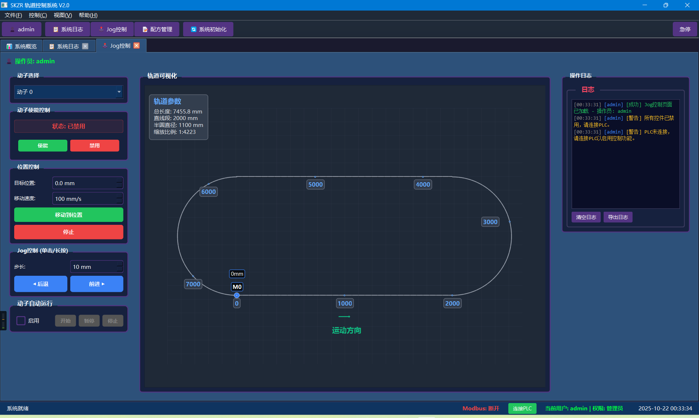
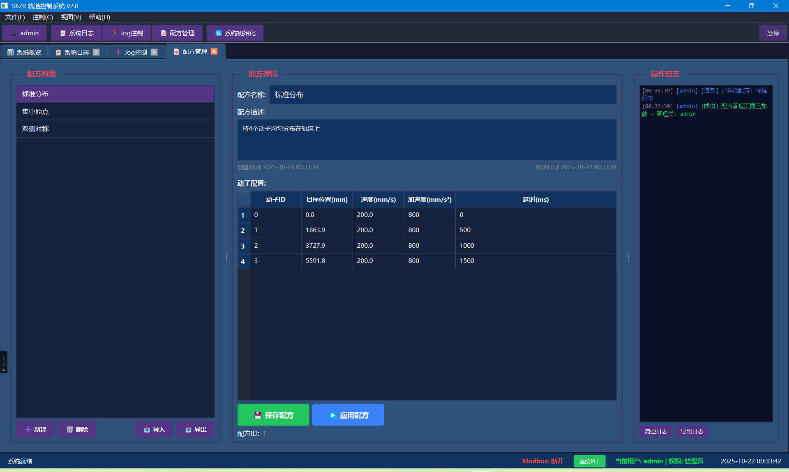
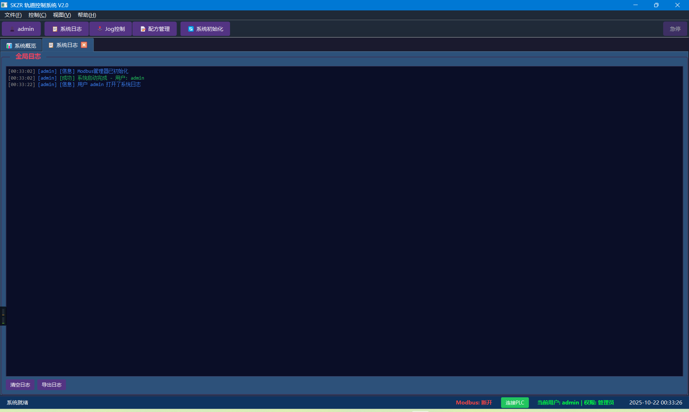

# Qt工业控制系统 (QT Industrial Control Beta)

基于Qt开发的工业自动化控制解决方案，提供完整的工业控制、监控和数据管理功能。

## 🚀 项目概述

本项目包含两个核心模块，为工业自动化应用提供全面的解决方案：

### 🎛️ ControlSystemUI - 控制系统用户界面
- **现代化UI设计**：基于Qt框架的响应式用户界面
- **实时监控**：设备状态实时显示和数据可视化
- **用户权限管理**：多级用户登录和权限控制
- **日志系统**：完整的操作日志记录和查询

### 🧲 MaglevControl - 磁悬浮控制系统
- **Modbus通信**：支持Modbus RTU/TCP协议的设备通信
- **配方管理**：灵活的生产配方创建、编辑和执行
- **运动控制**：精确的磁悬浮设备运动控制
- **多主题支持**：提供多种工业级UI主题

## ✨ 核心功能

### 📡 通信功能
- Modbus RTU/TCP协议支持
- 实时数据采集与处理
- 设备状态监控
- 通信故障诊断

### 🎮 控制功能
- 手动/自动控制模式
- 精确运动控制
- 安全联锁保护
- 急停功能

### 📊 数据管理
- 实时数据显示
- 历史数据记录
- 趋势图表分析
- 数据导出功能

### 🎨 用户界面
- 现代化工业风格设计
- 多主题切换支持
- 响应式布局
- 自定义样式系统

## 🛠️ 技术栈

- **开发框架**: Qt 5/6 (C++)
- **通信协议**: Modbus RTU/TCP
- **构建系统**: CMake / QMake
- **UI样式**: CSS/QSS样式表
- **数据处理**: Qt Charts, Qt SerialPort

## 📦 项目结构

```
QT_Industrial_ConBeta/
├── ControlSystemUI/           # 控制系统UI模块
│   ├── include/              # 头文件
│   ├── src/                  # 源代码文件
│   ├── CMakeLists.txt        # CMake构建文件
│   └── Mainwindow.ui         # UI设计文件
├── MaglevControl/            # 磁悬浮控制模块
│   ├── include/              # 头文件
│   ├── src/                  # 源代码文件
│   ├── Resource/             # 资源文件(图标、样式)
│   ├── README/               # 详细文档
│   └── MaglevControl.pro     # QMake项目文件
├── Resources/                # 项目资源文件
│   ├── C2.png               # 手动控制界面截图
│   ├── C3.png               # 配方管理界面截图
│   └── C4.png               # 系统日志界面截图
└── README.md                 # 项目说明文档
```

## 🚀 快速开始

### 环境要求
- Qt 5.12+ 或 Qt 6.x
- C++17 编译器
- CMake 3.16+ (ControlSystemUI)
- QMake (MaglevControl)

### 编译步骤

#### ControlSystemUI 模块
```bash
cd ControlSystemUI
mkdir build && cd build
cmake ..
make
```

#### MaglevControl 模块
```bash
cd MaglevControl
qmake MaglevControl.pro
make
```

## 📸 界面预览

### 🎮 手动控制界面 (Jog控制)


**核心功能：**
- 椭圆轨道可视化显示，实时显示动子位置
- 左侧控制面板：动子选择、轨道可视化、位置控制
- 支持目标位置设置、移动速度控制
- 实时显示轨道参数：总长度、直线段、半圆直径等
- 右侧实时日志显示系统状态和操作记录

### 📋 配方管理界面


**核心功能：**
- 左侧配方列表：标准分布、集中倍点、双峰对称等预设配方
- 中央配方详情：显示配方名称、描述和创建/修改时间
- 动子配置表：精确设置每个动子的目标位置、速度、加速度和延时
- 配方操作：保存配方、应用配方功能
- 支持多动子协调运动的复杂配方设计

### 📊 系统日志界面


**核心功能：**
- 全局日志统一显示：系统启动、Modbus连接、用户操作等
- 实时日志流：动态更新系统运行状态
- 多级日志显示：信息、警告、错误等不同级别
- 时间戳精确记录：便于问题追踪和系统分析
- 用户权限记录：完整的操作审计跟踪

## 🔧 配置说明

### Modbus通信配置
- 串口参数设置（波特率、数据位、停止位）
- TCP连接配置（IP地址、端口）
- 设备地址映射

### 主题配置
支持多种预设主题：
- `classic_blue_theme.css` - 经典蓝色主题
- `dark_industrial_theme.css` - 深色工业主题
- `light_modern_theme.css` - 现代浅色主题

## 📋 应用场景

- **工业自动化生产线**：设备控制和监控
- **磁悬浮系统**：精密运动控制
- **PLC通信**：上位机监控软件
- **数据采集系统**：工业数据监控

## 🤝 贡献指南

欢迎提交Issue和Pull Request来改进项目：

1. Fork 本仓库
2. 创建特性分支 (`git checkout -b feature/AmazingFeature`)
3. 提交更改 (`git commit -m 'Add some AmazingFeature'`)
4. 推送到分支 (`git push origin feature/AmazingFeature`)
5. 打开 Pull Request

## 📄 许可证

本项目采用 MIT 许可证 - 查看 [LICENSE](LICENSE) 文件了解详情

## 📞 联系方式

如有问题或建议，请通过以下方式联系：

- 🐛 提交 [Issues](https://github.com/MXS81/QT_Industrial_ConBeta/issues)
- 💡 功能建议通过 [Discussions](https://github.com/MXS81/QT_Industrial_ConBeta/discussions)

---

⭐ 如果这个项目对你有帮助，请给个Star支持一下！